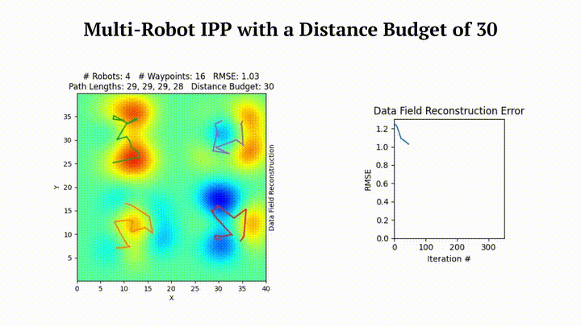

<div style="text-align:left">

</div>

# SGP-based Optimization Tools
Software suite for [Sensor Placement](https://itskalvik.com/publication/sgp-sp) (SP) and [Informative Path Planning](https://itskalvik.com/publication/sgp-ipp) (IPP)

<p align="center">
  
&nbsp; &nbsp; &nbsp; &nbsp;
  
</p>

## Method Summary
[](https://www.youtube.com/embed/G-RKFa1vNHM?si=PLmrmkCwXRj7mc4A "Video Summary")

## Codemap
- `demos/`: Jupyter notebooks with code to demonstrate each method in the library
    - `IPP.ipynb`: SGP-based IPP (point, non-point, continuous sensing, distance constrained, and multi-robot)
    - `IPPBaselines.ipynb`: SGP-based IPP approach and baseline methods
    - `non_point_FoV.ipynb`: IPP with non-point FoV sensors (drone camera setup)
    - `non_stationary_demo.ipynb`: SP with non-stationary kernel
    - `obstacles.ipynb`: SP in an environment with obstacles
- `sgptools/`: SGP-Tools library
    - `kernels/`: Kernel functions
        - `neural_kernel.py`: Neural Non-Stationary Spectral Kernel
    - `models/`: Sensor placement and IPP methods
        - `core/`: GP/SGP models used for sensor placement and IPP
            - `augmented_gpr.py`: GPflow's GP that supports transforms (expansion and aggregation)
            - `augmented_sgpr.py`: GPflow's SGP that supports transforms (expansion and aggregation)
            - `transformations.py`: Expansion and aggregation transforms for IPP
        - `bo.py`: Bayesian optimization-based sensor placement method that maximizes mutual information
        - `cma_es.py`: Genetic algorithm-based sensor placement method that maximizes mutual information
        - `continuous_sgp.py`: Continuous SGP-based sensor placement method
        - `greedy_mi.py`: Greedy sensor placement method that maximizes mutual information
        - `greedy_sgp.py`: Greedy SGP-based sensor placement method
    - `utils/`: Tools used for preprocessing the data, training GPs and SGPs, and generating paths
        - `data.py`: Tools to preprocess datasets
        - `gpflow.py`: Tools to interface with GPflow
        - `metrics.py`: Metrics used to quantify the solution quality
        - `misc.py`: Miscellaneous helper functions
        - `tsp.py`: TSP solver

## Datasets
* The Intel lab temperature dataset can be downloaded from [here](http://db.csail.mit.edu/labdata/labdata.html)
* The ROMS ocean salinity dataset can be downloaded from [here](https://oceanmodeling.ucsc.edu/ccsnrt/#txtOverview)
* The Precipitation dataset can be downloaded from [here](http://research.jisao.washington.edu/data_sets/widmann/)
* The US soil moisture dataset can be downloaded from [here](https://www.drought.gov/data-maps-tools/nasa-sport-lis-soil-moisture-products)
* The US elevation dataset can be downloaded from [here](https://coast.noaa.gov/digitalcoast/)

## Installation
Run the following commands to install the package

```
sudo apt-get install libhdf5-dev netcdf-bin libnetcdf-dev python3-pip -y
git clone https://github.com/itskalvik/sgp_tools.git
cd sgp_tools
python3 -m pip install -r requirements.txt
python3 -m pip install -e .
```

## About SGP-Tools
Please consider citing the following papers if you use SGP-Tools in your academic work :smile:

```
@misc{JakkalaA23SP,
AUTHOR={Kalvik Jakkala and Srinivas Akella},
TITLE={Efficient Sensor Placement from Regression with Sparse Gaussian Processes in Continuous and Discrete Spaces},
NOTE= {Preprint},
YEAR={2023},
URL={https://itskalvik.github.io/publication/sgp-sp},
}

@inproceedings{JakkalaA24IPP,
AUTHOR={Kalvik Jakkala and Srinivas Akella},
TITLE={Multi-Robot Informative Path Planning from Regression with Sparse Gaussian Processes},
booktitle={IEEE International Conference on Robotics and Automation, {ICRA}},
YEAR={2024},
PUBLISHER = {{IEEE}},
URL={https://itskalvik.github.io/publication/sgp-ipp}
}
``` 

## Acknowledgements
This work was funded in part by the UNC Charlotte Office of Research and Economic Development and by NSF under Award Number IIP-1919233.

## License
The SGP-Tools software suite is licensed under the terms of the Apache License 2.0.
See LICENSE for more information.
