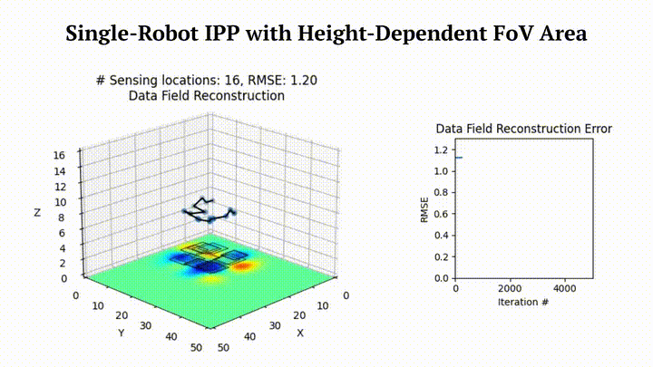
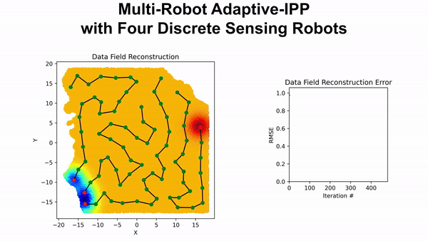
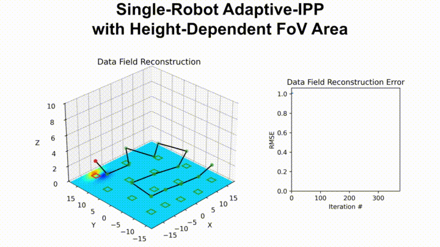
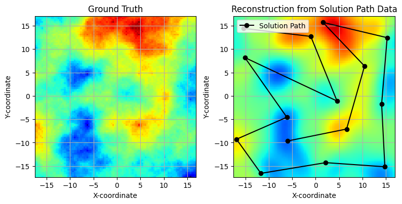

<p align="center">
  
  
</p>

<p align="center">
  <em>A Python library for efficient sensor placement and informative path planning</em>
</p>

<p align="center">
  <a href="https://pypi.org/project/sgptools/"></a>
  <a href="https://github.com/itskalvik/sgptools/blob/main/LICENSE"></a>
</p>

<p align="center">
  
  
  
  
</p>

## What is SGP-Tools?

**SGP-Tools** is a powerful and flexible Python library designed for solving **Sensor Placement** and **Informative Path Planning** problems, enabling efficient and scalable solutions for environment monitoring, e.g., monitoring air/water quality, soil moisture, or temperature.

### Sensor Placement

**Sensor Placement** is the problem of finding ideal locations to deploy a set of static sensors to best monitor a spatial phenomenon. The goal is to select a finite number of locations from a continuous space or a discrete set of candidates to maximize the information gathered about an entire area of interest. This is crucial when deploying a limited number of sensors to cover a large field.

### Informative Path Planning (IPP)

**Informative Path Planning** extends this concept to mobile sensors. Instead of finding static locations, IPP aims to compute an informative path for one or more robots to travel along. The path is designed to maximize information gain about the environment, often while adhering to constraints such as a limited travel distance. This is essential for applications like aerial surveying or robotic exploration.

### IPP vs. Lawnmower Paths

A common approach to surveying an area is to use a "lawnmower" path, a simple back-and-forth pattern designed for complete coverage. The following table summarizes the key differences between IPP and Lawnmower Paths:

| Factor | Lawnmower Path | Informative Path Planning (IPP) |
| :--- | :--- | :--- |
| **Primary Goal** | Complete and uniform coverage of a predefined area. | Targeted data collection in areas of high information or uncertainty. |
| **Performance** | Slow data collection but provides a high accuracy reconstruction of the envionment. | Fast data collection but provides an approximate reconstruction of the envionment. |
| **Prior Knowledge** | Not required; often used when no prior information is available. | Beneficial, but not required for adaptiev IPP; uses prior information to guide the sampling strategy. |
| **Adaptability** | Non-adaptive; the path is fixed before the mission starts. | Highly adaptive; the path is updated in real-time based on sensor data. |
| **Efficiency** | Can be inefficient if the phenomenon of interest is sparse. | Highly efficient for sparse or spatially variable phenomena. |
| **Computational Cost** | Low; simple to plan and execute. | Medium; requires onboard processing to analyze data and update the path. |
| **Best For** | Baseline mapping, homogenous environments, initial surveys. | Dynamic phenomena, resource-constrained missions. |

## Why SGP-Tools?

-   **State-of-the-Art Algorithms**: Includes a variety of optimization methods including greedy algorithms, Bayesian optimization, CMA-ES, and SGP-based optimization.
-   **Advanced Modeling Capabilities**: Go beyond simple point sensing with tools for informative path planning for multi-robot systems and complex sensor field-of-view (FoV) models.
-   **Non-Stationary Kernels**: Capture complex, real-world phenomena with specialized non-stationary kernels like the Neural Spectral Kernel and the Attentive Kernel.
-   **Flexible and Extensible**: Built on GPflow and TensorFlow, the library is designed to be modular and easy to extend with your own custom methods, kernels, and objectives.

## Installation
The library is available as a ```pip``` package. To install the package, run the following command:

```
python3 -m pip install sgptools
```

Installation from source:

```
git clone https://github.com/itskalvik/sgp-tools.git
cd sgp-tools/
python3 -m pip install -r requirements.txt
python3 -m pip install -e .
```

Note: The requirements.txt file contains packages and their latest versions that were last verified to be working without any issues.

## Quick Start

Here's an example of how to use SGP-Tools to get an informative path using the `ContinuousSGP` method:

```python
from sgptools.utils.data import Dataset # Class for loading and managing datasets
from sgptools.utils.misc import get_inducing_pts # Utility for selecting inducing points
from sgptools.utils.tsp import run_tsp # TSP/VRP solver for initial path planning
from sgptools.utils.gpflow import get_model_params # For training initial GP/SGP hyperparameters
from sgptools.methods import get_method # Gets the class for continuous SGP optimization
from sgptools.core.transformations import IPPTransform # Transforms for IPP

# 1. Load or generate a dataset
# This will create a synthetic dataset for demonstration
dataset = Dataset(num_train=500, num_test=10000, 
                  shape=(100, 100))
X_train, y_train = dataset.get_train()
X_test, y_test = dataset.get_test()

# 2. Learn the GP hyperparameters from the training data
print("Learning GP hyperparameters...")
_, noise_variance, kernel = get_model_params(
    X_train, y_train, max_steps=1000, verbose=True
)

# 3. Setup the IPP model
num_placements = 15

# Initialize inducing points and get initial path
Xu_init = get_inducing_pts(X_train, num_placements)
Xu_init, _ = run_tsp(Xu_init, time_limit=10)

# Setup IPP transform with a sampling rate for continuous sensing
transform_continuous_sensing = IPPTransform(sampling_rate=4)

# Initialize the ContinuousSGP model
method = get_method('ContinuousSGP')
csgp_optimizer = method(
    num_placements, 
    X_train, 
    kernel,
    noise_variance, 
    transform_continuous_sensing,
    X_init=Xu_init[0]
)

# 4. Run the optimization
print("Optimizing sensor placements...")
solution_path = csgp_optimizer.optimize(max_steps=200)

print(f"Solution Path: {solution_path}")
```

<p align="center">
  
</p>

For more detailed instructions, please refer to our [tutorials](http://sgp-tools.com/tutorials/index.html)

## SGP-based IPP
[](https://www.youtube.com/embed/G-RKFa1vNHM?si=PLmrmkCwXRj7mc4A "Video Summary")

## Datasets
High-resolution topography and bathymetry data can be downloaded from [NOAA Digital Coast](https://coast.noaa.gov/digitalcoast/)

## About
Please consider citing the following papers if you use SGP-Tools in your academic work 😄

```
@misc{JakkalaA23SP,
AUTHOR={Kalvik Jakkala and Srinivas Akella},
TITLE={Efficient Sensor Placement from Regression with Sparse Gaussian Processes in Continuous and Discrete Spaces},
NOTE= {Preprint},
YEAR={2023},
URL={https://www.itskalvik.com/research/publication/sgp-sp/},
}

@inproceedings{JakkalaA24IPP,
AUTHOR={Kalvik Jakkala and Srinivas Akella},
TITLE={Multi-Robot Informative Path Planning from Regression with Sparse Gaussian Processes},
booktitle={IEEE International Conference on Robotics and Automation, {ICRA}},
YEAR={2024},
PUBLISHER = {{IEEE}},
URL={https://www.itskalvik.com/research/publication/sgp-ipp/}
}

@inproceedings{JakkalaA25AIPP,
AUTHOR={Kalvik Jakkala and Srinivas Akella},
TITLE={Fully Differentiable Adaptive Informative Path Planning},
booktitle={IEEE International Conference on Robotics and Automation, {ICRA}},
YEAR={2025},
PUBLISHER = {{IEEE}},
URL={https://www.itskalvik.com/research/publication/sgp-aipp/}
}
``` 

## Acknowledgements
This work was funded in part by the UNC Charlotte Office of Research and Economic Development and by NSF under Award Number IIP-1919233.