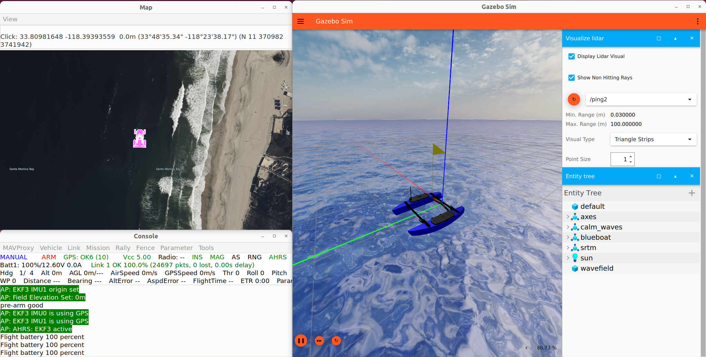

# [docker-sgp-tools :simple-github:](https://github.com/itskalvik/docker-sgp-tools)
The [docker-sgp-tools](https://github.com/itskalvik/docker-sgp-tools) package provides the following docker-compose scripts:

* ```robot-compose.yml```: A minimal docker container used to run SGP-Tools ROS2 package on ArduPilot-based robots.
* ```sitl-compose.yml```: A GUI-based docker container with ROS2, Gazebo, ArduPilot SITL, and SGP-Tools used for simulating ArduPilot vehicles and testing SGP-Tools IPP code. 

### Prerequisites

* [docker](https://docs.docker.com/engine/install/)
* [docker-compose](https://docs.docker.com/compose/install/)
* (Optional) [WSLg](https://learn.microsoft.com/en-us/windows/wsl/tutorials/gui-apps)

## Getting Started 
### Starting the Containers

Run the following commands to start the SITL docker container:

```bash
git clone --recurse-submodules https://github.com/itskalvik/docker-sgp-tools.git
cd docker-sgp-tools
docker-compose -f sitl-compose.yml pull
docker-compose -f sitl-compose.yml up -d
docker-compose -f sitl-compose.yml exec sgptools bash
```

Use ```robot-compose.yml``` to run the minimal docker container. 

### Running SGP-Tools Online/Adaptive IPP with Gazebo/ArduRover Simulator

<div style="text-align:left">

</a></p>
</div>

Use ```docker-compose -f sitl-compose.yml exec sgptools bash``` to get a new terminal. Run the following commands in separate terminals in the docker container:

- Launch Gazebo with the [AION R1 UGV](https://github.com/ArduPilot/SITL_Models/blob/master/Gazebo/docs/AionR1.md):
    ```
    gz sim -v4 -r r1_rover_runway.sdf
    ```
    To simulate a BlueBoat refer to this [documentation](https://github.com/ArduPilot/SITL_Models/blob/master/Gazebo/docs/BlueBoat.md). Note that the container already has Wave Sim installed in it.

- Launch [ArduRover SITL](https://ardupilot.org/dev/docs/sitl-simulator-software-in-the-loop.html):
    ```
    sim_vehicle.py -v Rover -f rover-skid --model JSON --add-param-file=$HOME/SITL_Models/Gazebo/config/r1_rover.param --console --map -N -l 35.30371178789218,-80.73099267294185,0.,0.
    ```
    Note: Restart sim_vechile.py if you get the following message: ```paramftp: bad count 1294 should be 1284```

- Launch the SGP-Tools Online/Adaptive IPP method:
    ```
    ros2 launch ros_sgp_tools single_robot.launch.py
    ```

## Building the Docker Containers from Scratch

First, setup buildx to build the containers for both arm64 and amd64 platforms: 
```bash
docker buildx create --name multi-arch \
  --platform "linux/arm64,linux/amd64" \
  --driver "docker-container"
docker buildx use multi-arch
```

Next, clone the repo and build the container. 
```bash
git clone --recurse-submodules https://github.com/itskalvik/docker-sgp-tools.git
cd docker-sgp-tools
docker-compose -f sitl-compose.yml build 
```

Use ```robot-compose.yml``` to build the minimal docker container.

## Other commands

- The docker-compose down command stops and removes containers, networks, volumes, and images, making it suitable for completely clearing all resources deployed by an application.

    ```bash
    docker-compose -f sitl-compose.yml down
    ```

- The docker-compose stop command just pauses running containers without removing them, which is ideal for temporary halts.

    ```bash
    docker-compose -f sitl-compose.yml stop
    ```

## References
Based on Dockerfiles from the following repos:

- https://github.com/Robotic-Decision-Making-Lab/blue
- https://github.com/ryomo/ros2-gazebo-docker
