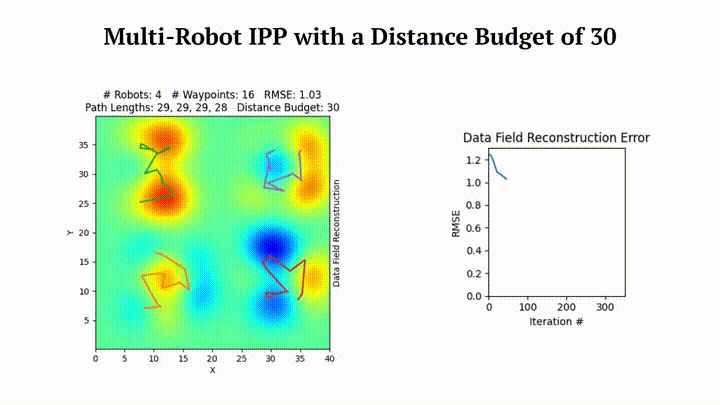

SGP-Tools is a software suite for [Sensor Placement](https://itskalvik.com/publication/sgp-sp) and [Informative Path Planning](https://itskalvik.com/publication/sgp-ipp).

The library includes python code for the following:

- Greedy algorithm-based approaches
- Bayesian optimization-based approaches
- Genetic algorithm-based approaches
- Sparse Gaussian process (SGP)-based approaches

<p align="center"></p>

## Installation
The library is available as a ```pip``` package. To install the package, run the following command:

```
python3 -m pip install sgptools
```

Installation from source:

```
git clone https://github.com/itskalvik/sgp-tools.git
cd sgp-tools/
python3 -m pip install -r requirements.txt
python3 -m pip install -e .
```

Note: The requirements.txt file contains packages and their latest versions that were last verified to be working without any issues.

## Quick Start
Please refer to the [example Jupyter notebooks](examples/IPP.html) demonstrating the methods included in the library 😄

## Method Summary
<p align="center"><div class="video-con"><iframe width="560" height="315" src="https://www.youtube.com/embed/G-RKFa1vNHM?si=PLmrmkCwXRj7mc4A" title="YouTube video player" frameborder="0" allow="accelerometer; autoplay; clipboard-write; encrypted-media; gyroscope; picture-in-picture; web-share" referrerpolicy="strict-origin-when-cross-origin" allowfullscreen></iframe></div></p>

## Datasets
* High-resolution topography data can be downloaded from [NOAA Digital Coast](https://coast.noaa.gov/dataviewer/#/lidar/search/where:ID=10046/details/10046)
* High-resolution bathymetry data can be downloaded from [NOAA Digital Coast](https://coast.noaa.gov/dataviewer/#/lidar/search/where:id=2475/details/2475)

## About
Please consider citing the following papers if you use SGP-Tools in your academic work 😄

```
@misc{JakkalaA23SP,
AUTHOR={Kalvik Jakkala and Srinivas Akella},
TITLE={Efficient Sensor Placement from Regression with Sparse Gaussian Processes in Continuous and Discrete Spaces},
NOTE= {Preprint},
YEAR={2023},
URL={https://itskalvik.github.io/publication/sgp-sp},
}

@inproceedings{JakkalaA24IPP,
AUTHOR={Kalvik Jakkala and Srinivas Akella},
TITLE={Multi-Robot Informative Path Planning from Regression with Sparse Gaussian Processes},
booktitle={IEEE International Conference on Robotics and Automation, {ICRA}},
YEAR={2024},
PUBLISHER = {{IEEE}},
URL={https://itskalvik.github.io/publication/sgp-ipp}
}
``` 

## Acknowledgements
This work was funded in part by the UNC Charlotte Office of Research and Economic Development and by NSF under Award Number IIP-1919233.

## License
The SGP-Tools software suite is licensed under the terms of the Apache License 2.0.
See LICENSE for more information.